```{r setup, include=FALSE}
knitr::opts_chunk$set(echo = TRUE)
library(knitr)
```

<html>
<style>
img.screenshot{
    box-shadow: 0 4px 8px 0 rgba(0, 0, 0, 0.2), 0 6px 20px 0 rgba(0, 0, 0, 0.19);
    border-radius: 5px;
    border: 1px solid rgba(0, 0, 0, 0.5);
    margin: 7px 7px 13px 7px; <!-- top right bottom left --> 
    align: center; 
  }
  
h1 {
  font-weight: bold; 
  padding-top: 15px; 
}
  
}
</style>

</html>

# Welcome

Using Git and GitHub is a great way to code collaborativly on projects.  Please use this guide to get set up or as reference for git commands.  

# Setup 

## Install Git Bash 

Go to [git-scm.com/download](https://git-scm.com/downloads) and click on the "Windows" link under "Downloads on the main screen.  

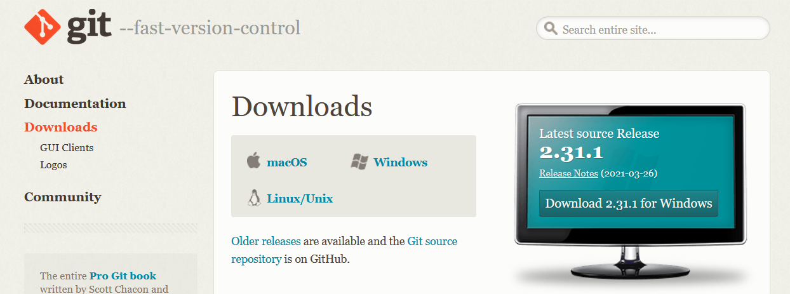 


**Update Git Bash**

```{git, eval = FALSE}
git update-git-for-windows
```


##  Set Up GitHub Account 

### Go to GitHub {.unnumbered}
Go to [github.com](https://github.com/) and click either on the large green button "Sign Up for GitHub" in the middle of the page or the small button "Sign Up" in the top right corner of the page.  


### Create Your Account {.unnumbered}
1. Create your own personal username 
1. Type in your email (SPRA email)  
1. Create your personal password
1. Click on the large blue button "Create account"

* *Optional:* un-check box so you don't recieve additional emails from GitHub
* *Note:* You may have to 'verify' account by completing some Captcha. 

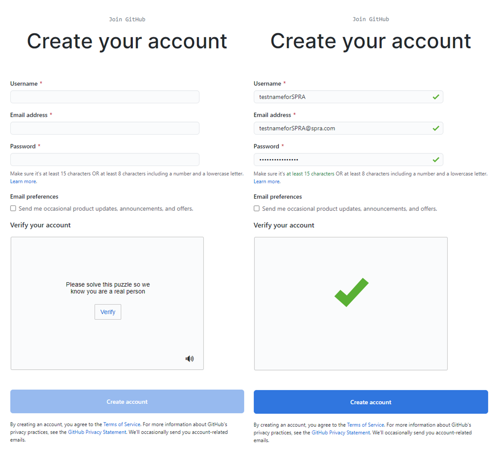  


## Access Repositories 

1. Inform relavent colleague(s) of the username you created (it's usually Josh)
1. Once username is given, individuals can give you an invitation to access to a repository, which you will receive via email 
1. Accept the invitation by clicking "View Invitation" button sent in the email.  This will take you to the GitHub page and now you can access the repository.
 


# Basic Git Processes  

## Create Clone 

<ol>
<li>Go to repository webpage </li>
<li>Click on the green "Code" button and copy the HTTPS path using the clipboard button </li> 
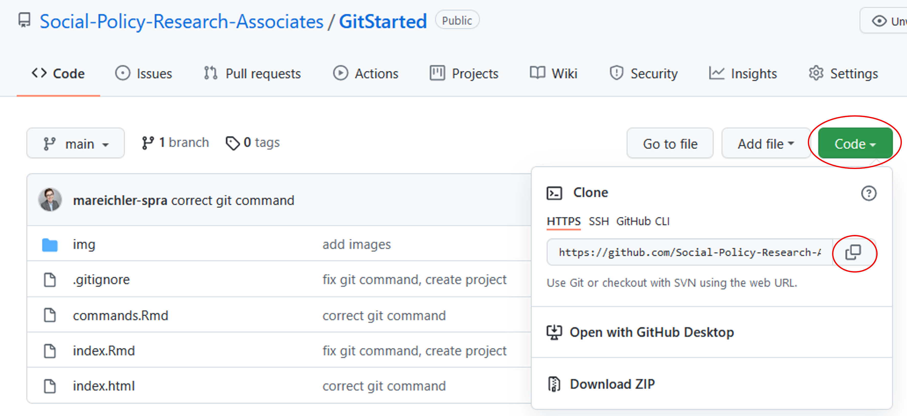 
<li>Go to the place on your machine where you want to have the code </li>
<i>Note: </i>Interacting with GitHub will be much faster if you put the code directly on your machine rather than on your personal hal folder.  I like to keep all my clones `C:\PROJECT-CLONES`.  This also makes the pathways shorter because it doesn't inlcude your name.  
<li>Right click in the folder and select "Git Bash Here" </li>
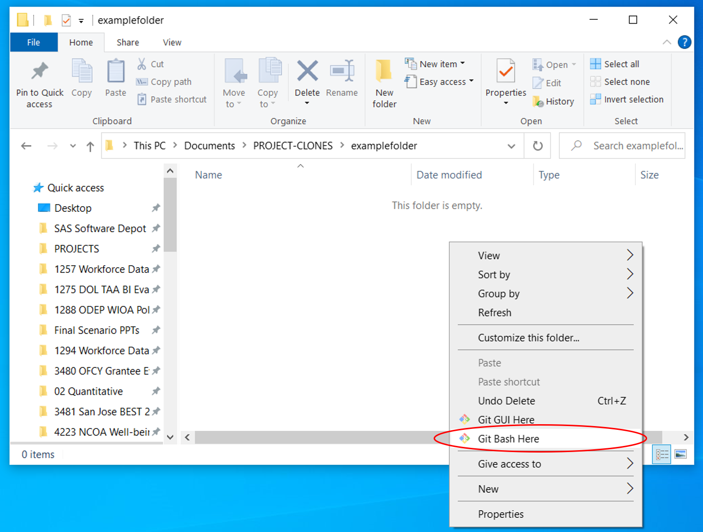 
<li>Git Bash window will appear with the path reflecting the path  </li>
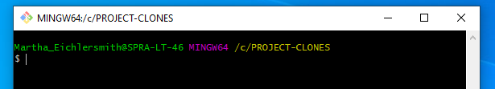 
<li>Write the command `git clone <repo HTTPS path>` where `<repo HTTPS path>` is the url from step 1; press Enter</li> 
<i>Note:</i> You can't copy/paste using Ctr+C/Ctr+V, but you can copy/paste using Ctr+C/Shift+Insert  
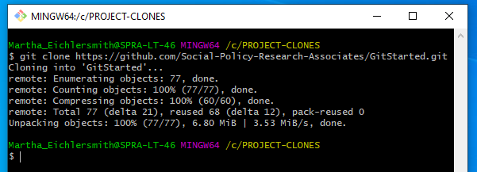 
<li> A folder will appear which has the same name as the repository, all files from the repo will be download there (in this example it's just a README.md file)</li> 
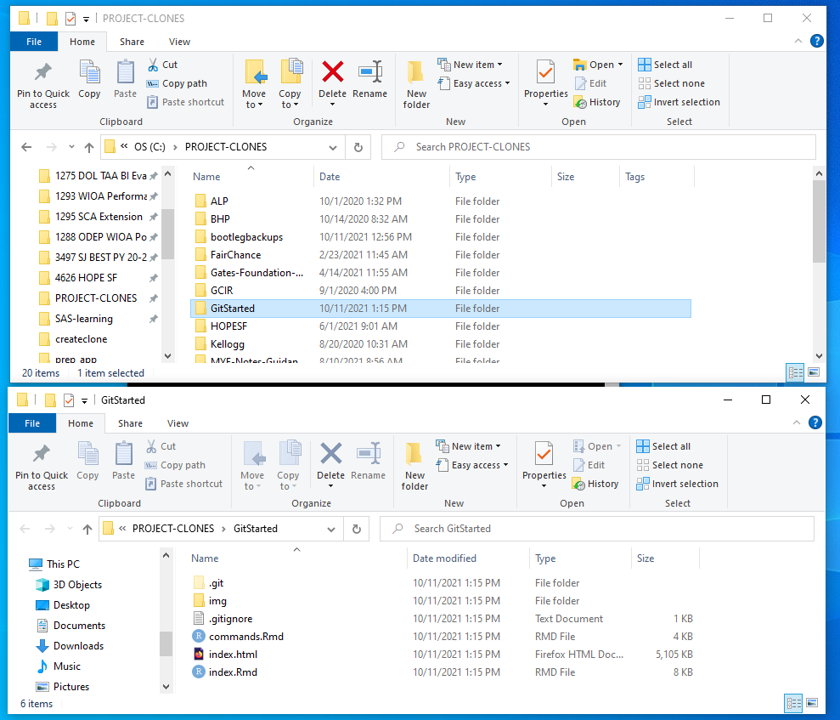 
</ol>

## Make Edits to Code  

<ol>
<li> Go into repository folder on machine, right click and select "Git Bash Here" </li> 
<li> **PRIOR TO MAKING ANY EDITS PULL MOST RECENT CODE FROM REPO:** `git pull origin <branch>`</li> 
Most often the `<branch>` you will be working on is `main` or `master`.  The branch you are working on will show up in blue font in parenthesis in the git bash window. Pulling the most recent code is essential for collaborative coding, this helps prevents conflicts to the code if edits are made on multiple different versions.  <br>
<i>Example: Code on Machine Already Up-to-Date (no changes were made)</i> 
 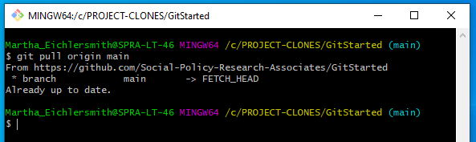 <br>
<i>Example: Code on Machine Updated (changes to code on machine)</i> 
 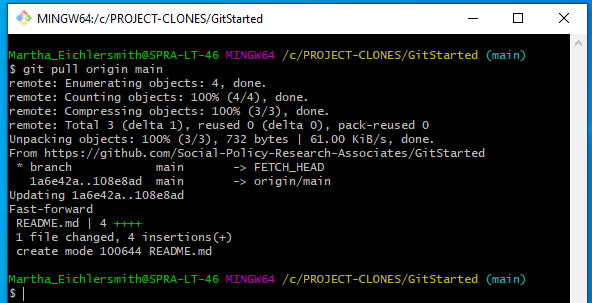 
<li> After you have pulled any changes, now you can start editing your document </li>
<li> After edits are complete, repeat step 1 to open the git bash window </li> 
<li> See which files were added, edited, or deleted using `git status` </li> 
In this case, I have made edits to the README.md file.  
 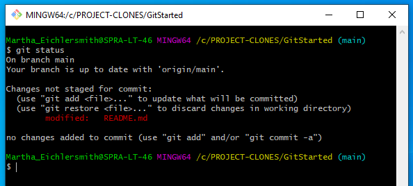 
<li> Review the changes by using `git diff` </li>
`git diff` will show all changes for any file, if you only want to look at changes for a specific file use `git diff <file>`.  
Red font means that text has been deleted and green font means that text has been added.  
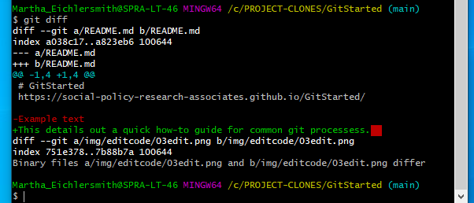 
<li> Once you are comfortable with your changes you need to stage the files, or 'add' them so they can be committed.  </li>
  <ul>
  <li> `git add --all` will stage all files that are listed after the `git status` command </li>
  <li> `git add <file>` will add only a specific file </li>
  <li> `git add *.R` will add all files that have a .R extension (stage all R scripts) 
  </ul>
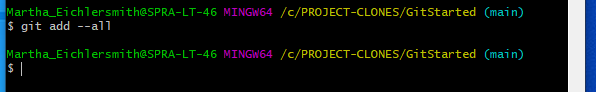
<li> Check that your files have been staged by using the `git status` command again, files that were in red font should now be in green font, indicating that they have been staged and are ready to be committed.  
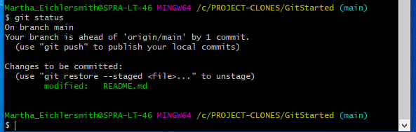 
<li> Commit changes using `git commit -m '<message>'` where `<message>` is a short description of the edits.  
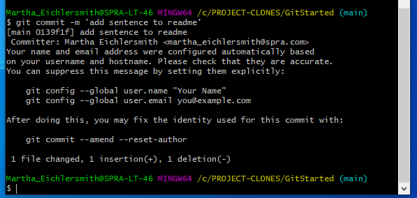 
<li> Finally, push your commits to GitHub using `git push origin <branch>`
Most often the `<branch>` you will be working on is `main` or `master`.
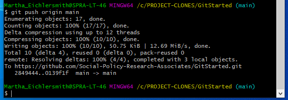 
</ol>

### Simple Review   

* **PULL:** `git pull origin <branch>`; to update code 
* **EDIT:** Make edits to files 
* *Optional:* `git status` to view which files have changed
* *Optional:* `git diff` to view line by line changes 
* **STAGE:** `git add --all` to stage all files 
* **COMMIT:**`git commit -m '<message>'` to commit changes 
* **PUSH:** `git push origin <branch>` to send changes to GitHub so others can access 

### Flow Charts


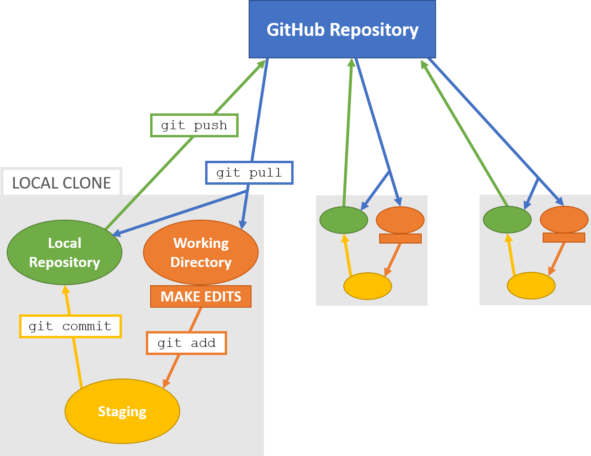  
  
<br><br>  
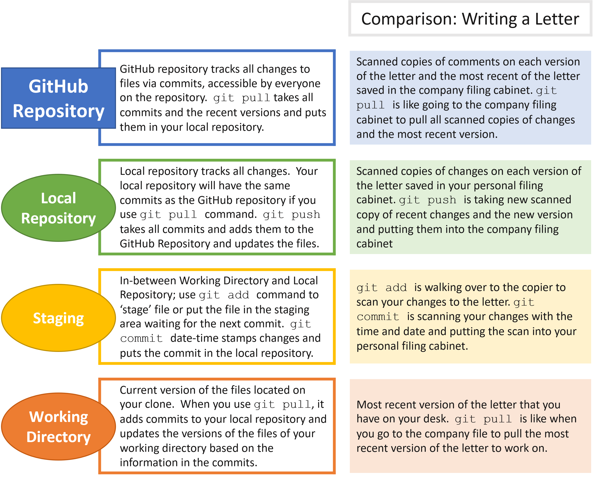
  
<br><br>  
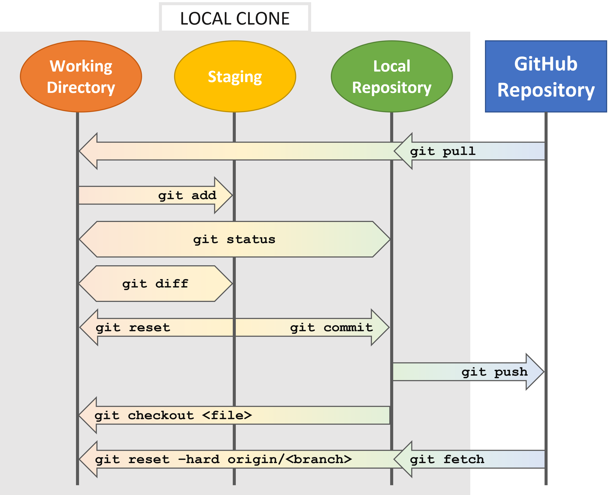

## Update Remote Link  

<ol>
<li> Go into repository on GitHub, click the green "Code" button and copy the HTTPS url </li> 
<li> Got to the repository folder on your machiene, right click and select "Git Bash Here" </li>
<li> Change the remote link with the following: 
```{bash, eval = FALSE}
git remote set-url origin <new-url>
```
<li> Check to see if the link has been updated using: 
```{bash, eval = FALSE}
git config --get remote.origin.url
```
The URL should now be the updated version.  <br>
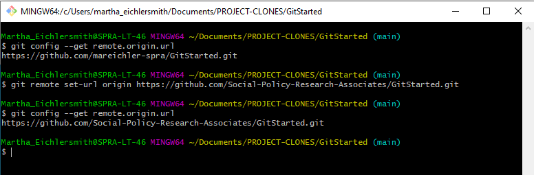 
</li>
</ol>


# Common Commands

```{r child = "commands.Rmd"}

```

